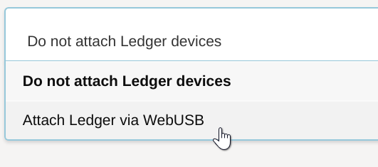
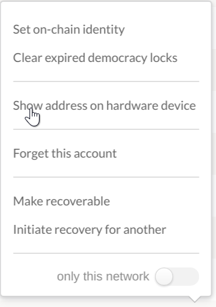

> WARNING: The Kusama Ledger application has not been approved by Ledger at the time of writing.
> Until the application is approved, you must either build the application yourself or download a
> pre-built binary from GitHub. The application is still considered in a development pre-release
> until an official release happens on the Ledger Live marketplace. Proceed with caution and use a
> spare development Ledger device if available.

Kusama has a [Ledger][] application that is compatible with the Ledger Nano S and Ledger Nano X
devices. The Ledger devices are hardware wallets that keep your secret secured on a physical device
that does not get exposed to your computer or the internet. It is strongly recommended to use a
hardware wallet if you are managing a significant amount of funds.

The Kusama application allows your to manage Kusama's native asset, the KSM. It supports all
of the available transaction types of the network.

## Requirements

This is a list of what you will need before starting:

- A Ledger Nano S or a Ledger Nano X.
- The latest firmware installed. At the time of writing this was 1.6.
- Ledger Live is installed.
- A web browser is installed that you can use to access [Polkadot-JS Apps][].

## Installing the Ledger Application

### Using Ledger Live

> NOTE: If you are reading this notice the Kusama application has not been approved for Ledger
> Live yet. If you would like to proceed with the pre-release installation please follow the 
> "Using the Developer Release" instruction below. Otherwise hold tight, the application should
> be approved soon!


### Using the Developer Release

> NOTE: These instructions are for pre-release only. They will be replaced by the instructions for
> downloading the applicaton directly from Ledger Live when it becomes available.

Instructions for downloading the prerelease binary from the GitHub releases is written [on the
README][prerelease instructions] for the Kusama Ledger application GitHub repository.

On the [releases page][] you can download the shell script `install_app.sh` and then make it executable in your
shell by typing the command `chmod +x install_app.sh`.

Using `install_app.sh` help command will show you the available options:

```zsh
$ ./install_app.sh --help
Zondax Installer [Kusama-1.2011.1] [Warning: use only for test/demo apps]
  load    - Load Kusama app
  delete  - Delete Kusama app
  version - Show Kusama app version
```

Next, you must make sure your Ledger device is plugged in and unlocked and you're using the latest
firmware (1.6 at the time of writing). If everything is prepared, then type `install_app.sh load` and
accept the prompts on your Ledger device to install the application.

First it will prompt you to allow an unsafe manager. Navigate all the way to the left and click both
buttons to allow the unsafe manager to install the kusama app.

After some processing time, the screen of your device will update to say "Install app Kusama". Again,
navigate all the way to the right, verify the Identifier hash matches the one that is printed in your terminal.
Click both buttons on "Perform Installation" to install the application. It will ask again for your Pin code and you should enter it in the device.

At the end of the process you should the newly installed Kusama application on the device. Great job!

## Using on Polkadot-JS Apps

### Loading Your Account

[Polkadot-JS Apps][] already has an integration with the Ledger application so that your device will
work with the browser interface after installation. The functionality is currently gated behind a
feature setting that you will need to turn on.

In order to turn on the interoperability with the Kusama Ledger application, go to the "Settings"
tab in Polkadot-JS Apps. Find the option for attachting Ledger devices and switch the option from
the default "Do not attach Ledger devices" to "Attach Ledger via WebUSB".



Click "Save" to keep your settings.

Now when you go to the "Accounts" tab you will see a new button that says "Query Ledger". Ensure
that your Ledger device is unlocked and you have navigated into the Kusama application, then click
this button.


You will not get any feedback from the web page, but if all went fine you should be able to scroll
down and find a new account on the page named "Ledger". Under the type column, the account will also
show "ledger".


You can now use this account to interact with Kusama on Polkadot-JS Apps and it will prompt your
ledger for confirmation when you initiate a transaction.

### Confirming the Address on your Device

On the "Accounts" tab, find your Ledger-connected account (the one called "Ledger"). Click on the three vertical dots
at the left of the row. This will open a new menu, here you can click the "Show address on hardware device" option
to display the address on your device.



Here you can scroll through and make sure the address matches to what is displayed on Polkadot-JS Apps.


### Checking Balance of Your Account

### Sending a Transaction

## Where to get help


[ledger]: https://www.ledger.com/
[Polkadot-JS Apps]: https://polkadot.js.org/apps
[prerelease instructions]: https://github.com/Zondax/ledger-kusama#download-and-install
[releases page]: https://github.com/Zondax/ledger-kusama/releases
